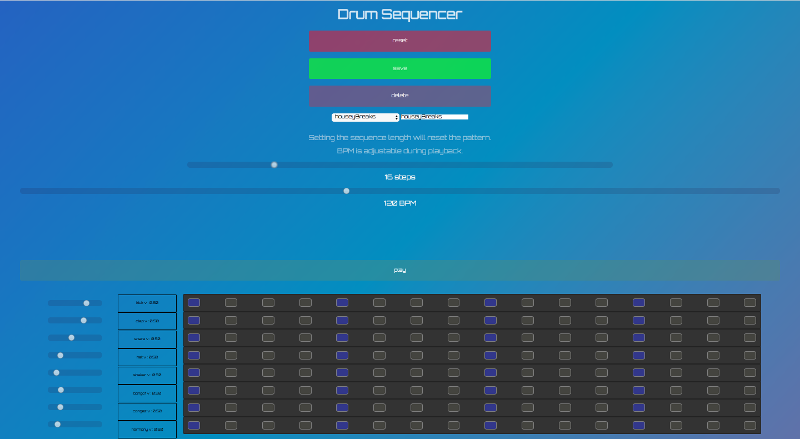
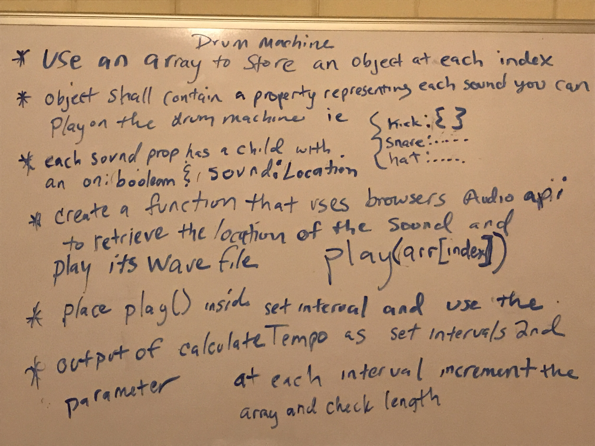
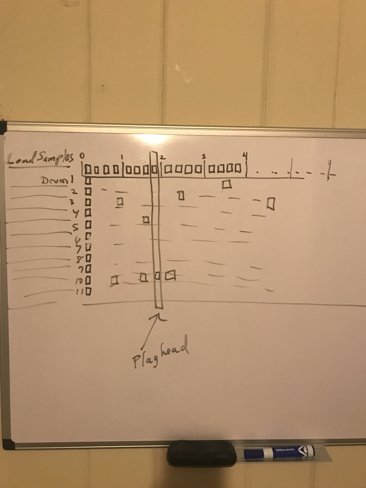
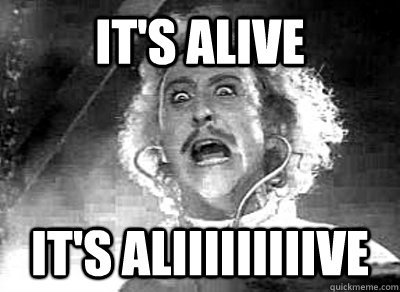

Last week, a coworker and friend challenged me to create a drum machine. The grand goal being to build an online DAW for people to collaborate on as a community. 
That goal is a bit far off yet, but what isn't is getting started right away exploring what can be done using web based music making tools people can play with.

I took that a step further beyond the usual MPC style drum machine that you will find across the internet, due to the challenge being officially part of the project curriculum of freecodecamp.org  These drum machines are usable if you have impeccable timing and dexterous fingers. After a few novel minutes, they tend to lose my interest, and probably yours too.  I wanted more than simply playing a sound on event.keyCode

I'm a hobbyist electronic musician.   I've always loved experimenting with hardware synthesizers, drum machines, and midi controllers. Naturally, 
I wanted to create a fun, creative, web based sequencer that might serve as a gateway for others into developing a love for creating electronic music.

## Ideas Begin to Take Shape

I had a basic idea of what I wanted, but not much else.  I had experience using sequencers to make music, but I had no idea how this sort of thing was implemented. 
I gestated on this for a few days and all of a sudden, the implementation came to me in the shower.

**Yes in the shower, as cliche as that is.  The mind is a funny thing and sometimes works on the problem for you in the background processes of your brain.**
**In a flurry, I took to my white board before I was even fully dry from the shower and started scribbling out what had been bestowed upon my conscious mind so suddenly.**

In a flurry, I took to my white board before I was even fully dry from the shower and started scribbling out what had been bestowed upon my conscious mind so suddenly.




After scratching down my preliminary ideas, I opened VS code and got down to coding it while the ideas were loaded into my head and ready to fly out of my fingers. 
Little did I know I was about to fall into a rabbit hole and entire universe of web audio, and the limitations of Javascripts single thread model.

I'll try and lay out my initial thought process as it slowly occured to me in the eureka moment.

1. sequencer needs ability to play samples that overlap on the same tick (note)
2. sequencer engine needs to loop at any length and tempo set by user
3. volume needs to be independently adjustable per sound
4. UI should be dynamically adjustable to the amount of bars set by user
5. UI should have full CRUD functionality in order to be useful.

## Sequencer Needs Ability to Play Samples That Overlap

What data structure needed to be used?  It seemed obvious I needed to use an array list of objects.

The naive approach would be to set a string representing the sample to be played and use a hash map to find the sample and play it.   
If I did this than for each sample, I would have to have one loop running for each sample used. 
That seemed like a lot more orchestration than I was willing to keep track of.   Instead, I chose to use a factory to create the object that gets pushed to each index of an array that represents the sequence. 
As the play head or needle passed over the index, it would check the properties of this object and read if the sound was set to true or false. 
If it was set to true, it would then play that sound.

Below is my first attempt at sketching out something that would prove to myself that I was on the right track . 
The first stab at this was done in node and not the browser.

```
let player = require("play-sound")();

// For each tick in a sequence this object will be checked
// to determine what instruments need
// to be triggered for the current tick.

function DrumMachineState(id) {
  this.id = id;
  this.kick = {
    on: false,
    name: "kick",
    location: "./samples/Deep House Drum Samples/bd_kick/bd_deephouser.wav"
  };
  this.clap = {
    on: false,
    name: "clap",
    location: "./samples/Deep House Drum Samples/clap/clp_analogue.wav"
  };
  this.hat = {
    on: false,
    name: "hat",
    location: "./samples/Deep House Drum Samples/hats/hat_analog.wav"
  };
  this.shaker = {
    on: false,
    name: "shaker",
    location:
      "./samples/Deep House Drum Samples/shaker_tambourine/shaker_bot.wav"
  };
  this.perc = {
    on: false,
    name: "perc",
    location: "./samples/Deep House Drum Samples/percussion/prc_bongodrm.wav"
  };
  this.perc2 = {
    on: false,
    name: "perc2",
    location: "./samples/Deep House Drum Samples/percussion/prc_congaz.wav"
  };
}

DrumMachineState.prototype.getState = function(name) {
  return this[name];
};
DrumMachineState.prototype.setState = function(name, on, volume) {
  this[name].on = on;
  this[name].volume = volume || 1;
  this[name].name = name;
};

// dependency inject the drum machine state into sequencer
function Sequencer(drumMachineState, length) {
  this.drumMachineState = drumMachineState;
  this.length = length;
  this.sequence = [];
}

Sequencer.prototype.initSeq = function() {
  for (let i = 0; i < this.length; i += 1) {
    this.sequence.push(new this.drumMachineState(i + 1));
  }

  return this.sequence;
};
```

[link to the commit shown above](https://github.com/JasonBBelcher/drum-machine/commit/69cf85ce517950b9d3ea8adde74b18c84056fed3?diff=unified)

The DrumMachineState constructor function is the meat of the sequencer engine.  It serves as a sort of factory for creating objects with the properties checked on each tick as the playhead passes over each note in the sequence.

I then used another constructor function to dependency inject the DrumMachineState as a property of the sequence. 
I then initialized the sequence by instantiating a DrumMachineState object into each index of the sequence array thus creating a
complete playable sequence to loop over. I think this was a much better solution than trying to sync up multiple loops for each drum sound.

First requirement was complete!  Now how do I get this darn thing to actually play something and loop?  setInterval!

**It wasn't the best solution in hind sight due to setInterval being pretty inaccurate.  Some of you JS audio programming geeks
know the pitfalls of setInterval sharing the single thread javascript runs on but gimme a break it's my first try at a project like this. 
We get into this in part 2 and explain why my approach will be different on version 2.**

## Sequencer Engine Needs to Loop at Any Length and Tempo Set by User

Enter the setInterval loop.  Good old setInterval - the trusty tool for long polling data from REST endpoints to make it look like an open websocket!   
I had a much more fun plan for setInterval this time.  It was going to be the heartbeat of the sequencer.  I had a few problems to solve first though.

1. How would I set the interval according to a beats per minute unit of time?
2. On each tick how do you actually read all the drum hits that are set to boolean of true and then play a selected wave file?
3. How do we ensure that it loops around no matter what the length of the sequence is?

I chose to use a plain old singleton object because we only ever needed one of these.  This serves as the transport commonly referred to by Digital Audio Workstations.

## How Would I Set the Interval According to a Beats Per Minute Unit of Time?

setInterval accepts as its second parameter an argument in milliseconds.  Instead of making the user of the method guess at how many milliseconds 120 bpm is,
I created a method to make the conversion based on a tempo and a ticks per beat. Ticks per beat  selects the resolution of your smallest note value.
There are 60,000 milliseconds in a minute so if you want to know how long a beat is in milliseconds for any tempo, then follow this formula:

**60,000 / BPM = one beat in milliseconds**

```
setTempo: function(tempo, ticksPerBeat = 1) {
    let ms;
    switch (ticksPerBeat) {
      case 1:
        ms = 60000 / tempo;
        break;
      case 2:
        ms = 30000 / tempo;
        break;
      case 4:
        ms = 15000 / tempo;
      default:
        ms = 15000 / tempo;
    }
    this.tempo = ms;
  },
```

[drum machine file at the first commit for context](https://github.com/JasonBBelcher/drum-machine/blob/69cf85ce517950b9d3ea8adde74b18c84056fed3/drum-machine.js)

Now I could use the ms conversion in the start method like so.  start() sets up the Interval at the correct tempo and loads it into a property
called playingSeq so that it can clear the interval later.  It then passes triggerSounds() the sequence array, grabs the index based on where the playHead is
which  is then consumed by this method, and increments the play head after triggering sounds.  It then does a check to see if we have reached the end of the loop. 
If so it reset the play head to zero and on and on looping we go until we decide we have had enough and stop the sequence.

```
start: function start(initializedSequence) {
    this.playingSeq = setInterval(() => {
      this.triggerSounds(initializedSequence[this.playHead]);
      this.playHead++;
      if (this.playHead === initializedSequence.length) {
        this.playHead = 0;
      }
    }, this.tempo);
  },
```

Stopping is a pretty simple affair of clearing the interval.  The funny biz with the m parameter is just me playing around with delaying the stop and starting
another one after returning a promise. If you look into the commits you will see that in the original node based sequencer. 
The only thing that is important is that of clearing the interval using the reference to the previously set interval.

```
stop: function stop(m) {
    if (m === undefined) {
      clearInterval(this.playingSeq);
    }
    setTimeout(() => {
      clearInterval(this.playingSeq);
    }, m);
  },
```

Now we come to the method that actually does the work of playing the sounds.  This is where the rubber meets the road and I finally got the sequencer to loop over sounds!
This method takes in the current drum state object at current index (note) and reaches into it and finds any drums that are set to on=true and plays them at the right volumes.
The player I'm using is a node npm package called [play-sound](https://www.npmjs.com/package/play-sound)

```
triggerSounds: function triggerSounds(dmState) {
    for (let instrument in dmState) {
      if (dmState.hasOwnProperty(instrument)) {
        if (dmState[instrument].on) {
          console.log(dmState.getState(instrument).location);
          player.play(dmState.getState(instrument).location, {
            afplay: ["-v", dmState.getState(instrument).volume]
          });
        }
      }
    }
  }
```

Finally I use the setter and getter methods I put on the prototype of every drum state object to build the sequence without a UI.

```
const sequencer = new Sequencer(DrumMachineState, 8);
const seq = sequencer.initSeq();

seq[0].setState("kick", true, 1);
seq[4].setState("kick", true, 0.8);
seq[4].setState("clap", true);
seq[2].setState("hat", true, 0.2);
seq[6].setState("hat", true, 0.24);
seq[0].setState("shaker", true, 0.2);
seq[1].setState("shaker", true, 0.1);
seq[2].setState("shaker", true, 0.2);
seq[3].setState("shaker", true, 0.1);
seq[4].setState("shaker", true, 0.2);
seq[5].setState("shaker", true, 0.1);
seq[6].setState("shaker", true, 0.2);
seq[7].setState("shaker", true, 0.1);
seq[1].setState("perc", true, 0.3);
seq[4].setState("perc", true, 0.4);
seq[5].setState("perc", true, 0.3);
seq[2].setState("perc2", true, 0.3);
seq[3].setState("perc2", true, 0.5);
seq[7].setState("perc2", true, 0.25);

dm.setTempo(127, 4);
dm.start(seq);
```

[and BOOM!! IT'S ALIVE!!!!!!!!!!!!](https://drive.google.com/file/d/1vHBv9r3xkR5w1rAW4f_wcnR0PB2YOyyl/view?usp=sharing)



TLDR? [Drum sequencer github project](https://github.com/JasonBBelcher/drum-machine)
