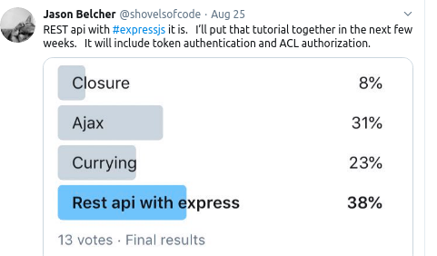

A while back, I posted a survey on twitter to see what might be of interest.



Ajax and Rest api were neck and neck. Due to the results, I've decided
to cover the basics of a full stack application. Todo tutorials are plentiful
for a reason. They are simple enough to convey concepts without getting too deep
into the weeds, but are complex enough to cover many concepts found in real-world
applications.

I won't get into authentication or authorization this time - I think I got a little
too ambitious in the tweet. :) I'll focus directly on the todo app's core functionalities
as well as all the CRUD operations. First, I build this app purely on
the front-end, persisted with localStorage. Then, I create a back-end that
will serve up todos. Lastly, I refactor the front-end code to connect it to the back-end with AJAX.

## Todo Entity Class

It is good to first define the shape of the data you are dealing with. A simple
class will work fine since all we are dealing with are simple Todos.  
What are the properties we might have for each todo?

For my implementation, I
decided it would be nice to have a priority so that todos can be searched by
their importance. An id is useful to make each todo unique. Text is obviously
the whole reason for a todo to exist and the completed property lets the user
know the progress they have made so far. You don't have to define a class to wrap
the todo data. You could easily use an interface. Really, you could just as easily
use an object literal.

One interesting difference to note is that [typescript](https://www.freecodecamp.org/news/learn-typescript-in-5-minutes-13eda868daeb/) interfaces are stripped away at runtime. Classes are not.
Notice how there is a method on the todo class that generates Ids. This type of encapsulation
could also be extended to take care of changing priority and completed flags. Because I know
that localStorage will strip away any methods when serializing to JSON format I'm choosing
to keep that functionality inside the angular service. genId() will only be needed when posting
so it won't matter if the method disapears off the object instance later.

---

```typescript
export class Todo {
  id: number
  text: string
  completed: boolean
  priority: number

  constructor(text, completed, priority) {
    this.id = this.genId()
    this.text = text
    this.completed = completed
    this.priority = priority
  }

  genId(): number {
    return Math.random() * 10
  }
}
```

---

#### Deeper Reading

- [entity class](https://stackoverflow.com/questions/2550197/whats-the-difference-between-entity-and-class)

---

## Todo Service

Next, I create an angular service to handle all actions associated with Todos.
Angular services are a great way to share functionality to other components.
Right now, we have no backend so all persistance will be done using [localStorage](https://developer.mozilla.org/en-US/docs/Web/API/Window/localStorage)
available in all modern browsers. Later, this mocked service will be replaced with the [api
service that will talk to the Node Express todo api](./todo-app-part2).

---

```typescript
// todo service snippets

import { Injectable } from "@angular/core"
import { Todo } from "./todo"

@Injectable()
export class RepositoryService {

```

---

private property to handle the todo state
It is declared as an array of type Todo defined earlier as an entity class
if no todos are found in local storage then load as an empty array.

```typescript
private todos: Array<Todo> = JSON.parse(localStorage.getItem("todos")) || []

```

---

`createTodo()` takes in a string as input and pushes a new Todo Entity
to the `todos` array. It passes in defaults of completed false and
sets a default priority of zero. Then we refresh local storage to
reflect the todos in memory.

```typescript
  createTodo(todotext) {
    this.todos.push(new Todo(todotext, false, 0))

    localStorage.setItem("todos", JSON.stringify(this.todos))
  }

```

---

`getTodos()` is an automatically resolved promise with a
payload of the private property defined as an array
of todo entities. I used resolved Promises so that
my component code will be written in a way that
expects asynchronously delivered todos.
This sets up the code to be easily switched out
for a real backend later.

```typescript

getTodos() {
  return Promise.resolve(this.todos)
}

```

---

`updateTodo()` is a little tricky because before we can
change the todo we need to find the todo we want to
update first then update it. [Array.prototype.findIndex](https://developer.mozilla.org/en-US/docs/Web/JavaScript/Reference/Global_Objects/Array/findIndex)
will return to us an index in the array based on a
boolean test. In this case, we use the id to match for
uniqueness. If a match is found, it gets returned.

Using the returned index the changed todo passed into
the updateTodo method can overwrite the right todo
by passing it to the todos array.

```typescript

updateTodo(todo) {
  const index = this.todos.findIndex(t => {
    return t.id === todo.id
  })

  this.todos[index] = todo

  localStorage.setItem("todos", JSON.stringify(this.todos))

  return Promise.resolve(this.todos)
}
```

---

using filter you can match on the id of a todo and return
the entire array except the one matched. Another way to
do this is with splice() but this is cleaner to read.

```typescript

removeTodo(id) {
  this.todos = this.todos.filter(todo => todo.id !== id)
  localStorage.setItem("todos", JSON.stringify(this.todos))
  return Promise.resolve(this.todos)
}

changePriority(event) {
  if (event.operation === "+") {
    event.todo.priority += 1
  }
  if (event.operation === "-") {
    if (event.todo.priority > 0) {
      event.todo.priority -= 1
    }
  }
}

getFilteredTodos() {
  return Promise.resolve(this.filteredTodos)
}
```

---

`filterSearch()` takes in a string or number. If it's a number it uses
the Array.prototype.filter method to check if the searched
priority number matches the input value passed in.
if the value is a string it filters down the todos by looking
at the text property and sends back all results that match
any combination of characters. indexOf will return either the
index or -1 which is coerced to false by javascript.

```typescript
filterSearch(value) {
  if (!isNaN(value)) {
    this.filteredTodos = this.todos.filter(
      todo => parseInt(todo.priority, 10) === parseInt(value, 10)
    )
  } else if (typeof value === "string") {
    this.filteredTodos = this.todos.filter(todo => {
      return todo.text.toLowerCase().indexOf(value.toLowerCase()) > -1
    })
  }

  // allows an empty thenable on the component side so things continue to work
  // when we plug into a real api that will have latency associated with it.
  return Promise.resolve()
}
```

---

`clearTodos()`resets the array to an empty array.

```typescript
  clearTodos() {
    localStorage.removeItem("todos")
    return Promise.resolve((this.todos = []))
  }
}

```

---

[Show me the project code!](https://codesandbox.io/s/angular-2c6v2?fontsize=14&hidenavigation=1&theme=dark)

---

## Todo Component Template

I'm using [template variables](https://blog.angulartraining.com/tutorial-the-magic-of-template-reference-variables-3183f0a0d9d1) notated with hash symbols `#inputvalue` to grab the input values
to pass to the component method `addTodo()` on `(click)` and on `(keyup.enter)`. You could also bind a property and use ngModel [banana in
the box syntax](https://blog.angulartraining.com/tutorial-create-your-own-two-way-data-binding-in-angular-46487650ea82) `[()]` for two way data binding.

I have defined methods for the following:

- Adding a Todo
- Searching a list of Todos
- Clearing all Todos

Inside of this template is a dummy component that accepts a todo as input using `@Input` decorator

Three methods are listed on this component

- onRemoveTodo
- onToggleComplete
- onChangePriority

All three emit parts of a todo object needed by the parent component methods. This
is accomplished with an `@Output` decorator and the EventEmitter class to emit custom events.
Without this mechanism we would not be able to communicate between parent and child
components.

### todo-item component

```typescript
import { Component, Input, OnInit, Output, EventEmitter } from "@angular/core"
import { Todo } from "./todo"

@Component({
  selector: "todo-item",
  template: `
    <p class="todo-text" [class.completed]="todoItem.completed">
      {{ todoItem.text }}
    </p>
    <span class="operators" (click)="onChangePriority('+', todoItem)">+</span>
    <span class="operators" (click)="onChangePriority('-', todoItem)">-</span>
    <p class="priority">priority: {{ todoItem.priority }}</p>

    <button (click)="onRemoveTodo(todoItem.id)">Remove</button>
    <button (click)="onToggleComplete(todoItem)">Completed</button>
  `,
})
export class TodoItem implements OnInit {
  @Input("todo") todoItem: Todo<string, boolean, string>
  @Output() removed = new EventEmitter<number>()
  @Output() toggled = new EventEmitter<Todo<string, boolean, string>>()
  @Output() priority = new EventEmitter<{}>()

  onChangePriority(operation, todo) {
    this.priority.emit({ operation, todo })
  }

  onToggleComplete(todo) {
    this.toggled.emit(todo)
  }

  onRemoveTodo(id) {
    this.removed.emit(id)
  }
}
```

---

Notice how the events used in the template snippet below match up to the todo item component @Output properties.
The `onAction()` methods defined there exist to do one thing and that is to pass the event data
back up the view tree to the parent. The custom events values are then captured and passed into the
parent level methods using the `$event` object. Instead of a standard browser event object it will
contain the data you specified in the child component using the `this.outputprop.emit()` syntax.

### todo-item template snippet

```html
<li *ngFor="let todo of todos">
  <todo-item
    [todo]="todo"
    (removed)="removeTodo($event)"
    (toggled)="toggleComplete($event)"
    (priority)="changePriority($event)"
  ></todo-item>
</li>
```

---

### Parent App Component Template

```html
<div class="container">
  <header>
    <h1>Angular Todo Demo</h1>
  </header>

  <nav class="add-todo">
    <input
      class="todo-input"
      #inputvalue
      (keyup.enter)="addTodo(inputvalue)"
      type="text"
      placeholder="Add a todo"
    />
    <button (click)="addTodo(inputvalue)">Add Todo</button>
    <input
      class="todo-input"
      (keyup)="filterSearch($event.target.value)"
      placeholder="search your todos"
      type="text"
    />
    <button (click)="clearTodos()">Clear</button>
  </nav>

  <section>
    <ul>
      <li *ngFor="let todo of todos">
        <!-- Here is the todo item dumb component being consumed by the parent template  -->
        <todo-item
          [todo]="todo"
          (removed)="removeTodo($event)"
          (toggled)="toggleComplete($event)"
          (priority)="changePriority($event)"
        ></todo-item>
      </li>
    </ul>
  </section>

  <footer>
    <p>
      Find me at my blog <a href="https://jasonbelcher.dev">jasonbelcher.dev</a>
    </p>
  </footer>
</div>
```

---

#### Deeper Reading

- [Decorators](https://www.typescriptlang.org/docs/handbook/decorators.html)
- [Output Decorator](https://dzone.com/articles/understanding-output-and-eventemitter-in-angular)
- [Publish Subscribe Pattern in Angular](https://www.syntaxsuccess.com/viewarticle/pub-sub-in-angular-2.0)

---

### Todo Component Consumes The Todo Service

Here is where the full worth of services comes into play. This service could be
used in any component that needs it. If I need to change something about the
implementation of any method inside the service it is only changed in one place.
[Here is a more detailed explanation of services](https://dzone.com/articles/what-is-a-service-in-angular-js-why-to-use-it)

```typescript
import { Component, OnInit } from "@angular/core"
import { RepositoryService } from "./repository.service"
import { Todo } from "./todo"

@Component({
  selector: "app-root",
  templateUrl: "./app.component.html",
  styleUrls: ["./app.component.css"],
})
export class AppComponent implements OnInit {
  todos: any[]
  // dependancy inject the service to be used.
  constructor(private repository: RepositoryService) {}

  // initial list of todos currently stored

  ngOnInit() {
    this.repository.getTodos().then(todos => {
      this.todos = todos
    })
  }

  /* calls the createTodo service method and passes in
     the input value from the user. After posting the 
    input is cleared.  If there is no value no call is
    made  */

  addTodo(input) {
    if (input.value) {
      this.repository.createTodo(input.value)
      this.getTodos()
      input.value = ""
    } else {
      return
    }
  }

  // clear all todos

  clearTodos() {
    this.repository.clearTodos().then(todos => {
      this.todos = todos
    })
  }

  // get all todos

  getTodos() {
    this.repository.getTodos().then(todos => {
      this.todos = todos
    })
  }

  // change priority scores

  changePriority(event) {
    this.repository.changePriority(event)
    this.repository.updateTodo(event.todo)
  }

  // toggle complete or uncomplete

  toggleComplete(todo) {
    todo.completed = !todo.completed
    this.repository.updateTodo(todo)
  }

  // remove a single todo

  removeTodo(id) {
    this.repository.removeTodo(id).then(todos => {
      this.todos = todos
    })
  }

  /* filter search only if there is a value.  If there isn't 
    load all stored todos from local storage.
    */
  filterSearch(value) {
    if (!value) {
      this.repository.getTodos().then((todos: Todo[]) => {
        this.todos = todos
      })
    } else {
      this.repository.filterSearch(value).then(() => {
        // inside thenable it's safe to get the filtered
        // todos.  It would work without it but when an api with latency
        // is added this will save us from race conditions.

        this.repository.getFilteredTodos().then((todos: Todo[]) => {
          this.todos = todos
        })
      })
    }
  }
}
```

---

#### Code Sand Box This Post is Based On

[github todo project](https://github.com/JasonBBelcher/angular-todos/tree/blog-todo-app)

[editor link](https://codesandbox.io/s/angular-2c6v2?fontsize=14)

<iframe
  src="https://codesandbox.io/embed/angular-2c6v2?fontsize=14"
  style="width:100%; height:500px; border:0; border-radius: 4px; overflow:hidden;"
  title="Angular"
  allow="geolocation; microphone; camera; midi; vr; accelerometer; gyroscope; payment; ambient-light-sensor; encrypted-media; usb"
  sandbox="allow-modals allow-forms allow-popups allow-scripts allow-same-origin"
></iframe>
